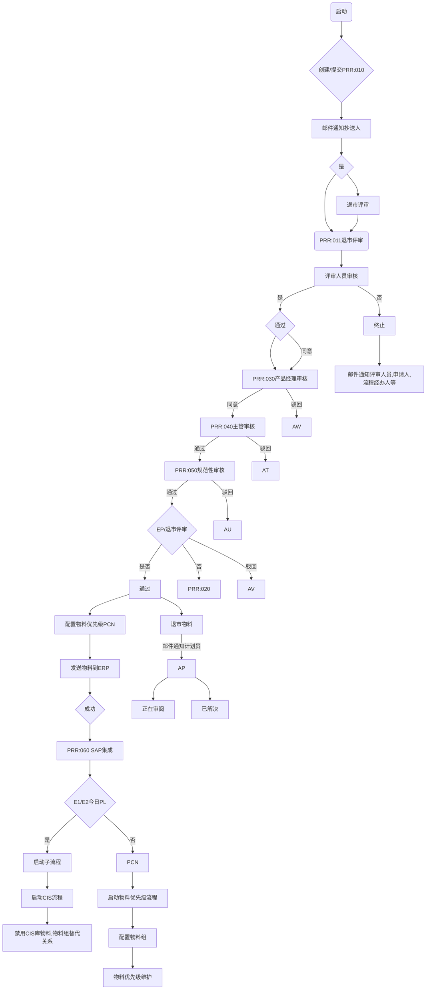

```mermaid

flowchart TD
    A(启动) --> B{创建/提交PRR:010}
    B --> C[邮件通知抄送人]
    C --> D{PL是否发布}
    D{否} --> E[退市评审]
    D{是} --> F(PRR:011退市评审)
    E --> F
    F --> G[评审人员审核]
    G -->|是| H{通过}
    G -->|否| I[终止]
    H --> J[PRR:030产品经理审核]
    J -->|同意| K[PRR:040主管审核]
    K -->|通过| L[PRR:050规范性审核]
    L -->|通过| M{EP/退市评审}
    M -->|是否| N[通过]
    M -->|否| O[PRR:020]
    N --> P[配置物料优先级PCN]
    P --> Q[发送物料到ERP]
    Q --> R{成功}
    R{成功} --> S[PRR:060 SAP集成]
    S --> T{E1/E2今日PL}
    T -->|是| U[启动子流程]
    U --> V[启动CIS流程]
    V --> W[禁用CIS库物料,物料组替代关系]
    T -->|否| X[PCN]
    X --> Y[启动物料优先级流程]
    Y --> Z[配置物料组]
    Z --> AA[物料优先级维护]
    H -->|同意| J
    N --> AO[退市物料]
    AO -->|邮件通知计划员| AP
    AP --> AQ[正在审阅]
    AP --> AR[已解决]
    I --> AS[邮件通知评审人员,申请人,流程经办人等]
    K -->|驳回| AT
    L -->|驳回| AU
    M -->|驳回| AV
    J -->|驳回| AW
```