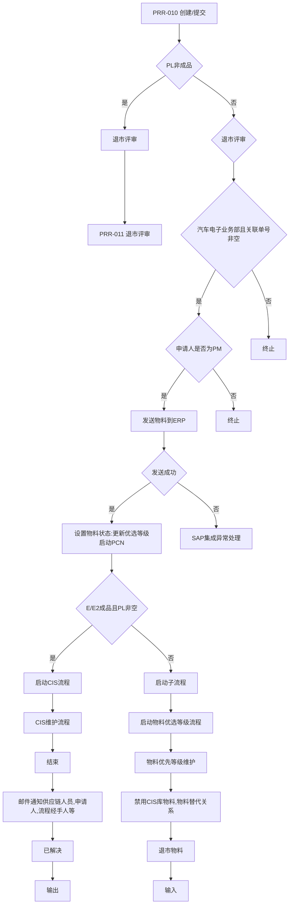

```mermaid
graph TD
    A[PRR-010 创建/提交] --> B{PL非成品}
    B -- 是 --> C[退市评审]
    B -- 否 --> D{退市评审}
    C --> E[PRR-011 退市评审]
    D --> F{汽车电子业务部且关联单号非空}
    F -- 是 --> G{申请人是否为PM}
    F -- 否 --> H[终止]
    G -- 是 --> I[发送物料到ERP]
    G -- 否 --> J[终止]
    I --> K{发送成功}
    K -- 是 --> L[设置物料状态:更新优选等级启动PCN]
    K -- 否 --> M[SAP集成异常处理]
    L --> N{E/E2成品且PL非空}
    N -- 是 --> O[启动CIS流程]
    N -- 否 --> P[启动子流程]
    O --> Q[CIS维护流程]
    P --> R[启动物料优选等级流程]
    Q --> S[结束]
    R --> T[物料优先等级维护]
    S --> U[邮件通知供应链人员,申请人,流程经手人等]
    T --> V[禁用CIS库物料,物料替代关系]
    U --> W[已解决]
    V --> X[退市物料]
    W --> Y[输出]
    X --> Z[输入]

```